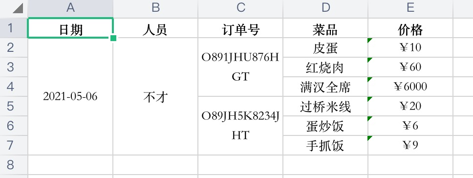

# 树结构 EXCEL 导出

解析`树结构`并导出 excel    

1. 自动计算并合并单元格
2. 树结构保留
3. API简洁
4. 高度内聚

### 依赖

1. FileSaver.js
2. exceljs

### 数据格式要求

```json
[
  {
    value: "value 1",
    list: [
      {
        value: "value 2"
      },
    ]
  }
]
```
### 示例
```javascript
// 数据
const header = ['日期','人员','订单号','菜品','价格'];
const data = [
  {
    value: "2021-05-06",
    list: [
      {
        value: "不才",
        list: [
          {
            value: "O891JHU876HGT",
            list: [
              {
                value: "皮蛋",
                list:[
                  {
                    value: "¥10"
                  }
                ]
              },
              {
                value: "红烧肉",
                list:[
                  {
                    value: "¥60"
                  }
                ]
              },
              {
                value: "满汉全席",
                list:[
                  {
                    value: "¥6000"
                  }
                ]
              }
            ]
          },
          {
            value: "O89JH5K8234JHT",
            list: [
              {
                value: "过桥米线",
                list:[
                  {
                    value: "¥20"
                  }
                ]
              },
              {
                value: "蛋炒饭",
                list:[
                  {
                    value: "¥6"
                  }
                ]
              },
              {
                value: "手抓饭",
                list:[
                  {
                    value: "¥9"
                  }
                ]
              }
            ]
          }
        ]
      },
    ]
  }
];

ExportXlsxByTreeData.exportExcel(header, data);

```
渲染效果




### 如何使用？

详情可参考demo.html

1. down [ExportXlsxByTreeData.js](ExportXlsxByTreeData.js)
2. 引入依赖
3. 调用 ExportXlsxByTreeData.exportExcel(header, data);
